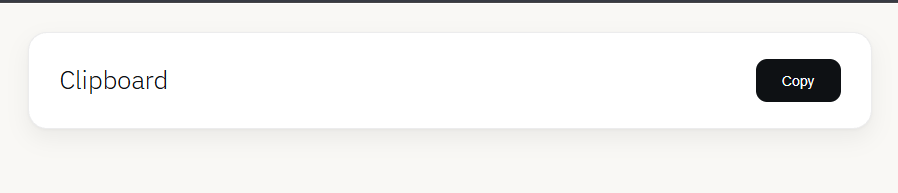
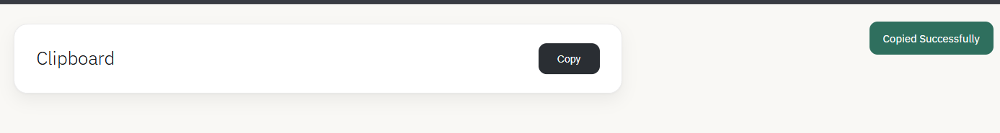

# Google Docs Copy Web App

A lightweight Google Apps Script web application that transforms any Google Document into a clean, shareable web interface with one-click copy functionality.

## Features

- Automatically reads the active Google Document.
- Displays the document title dynamically.
- Copies the complete document content with a single click.
- Minimal and responsive UI.
- Mobile-friendly design.
- Easy deployment using Google Apps Script Web App.

---

## Demo Workflow

1. Create or open a Google Document.
2. Open **Extensions → Apps Script**.
3. Paste the provided `Code.gs` and `Index.html`.
4. Deploy the project as a Web App.
5. Open the generated Web App URL.
6. Click **Copy** to instantly copy the document content.

---

## Technology Stack

- Google Apps Script
- HTML5
- CSS3
- JavaScript
- Google Docs API (DocumentApp)

---

## Project Structure

```text
Code.gs        → Backend logic
Index.html     → User Interface
```

---

## How It Works

### Backend

The Apps Script:

- Retrieves the currently active Google Document.
- Extracts the document title.
- Extracts the entire document body text.
- Sends both values to the HTML template.

### Frontend

The web interface:

- Displays the document title.
- Stores document content in a hidden container.
- Uses the Clipboard API to copy content.
- Shows a success notification after copying.

---

## Installation

### Step 1: Create a Google Document

Create or open any Google Document.

### Step 2: Open Apps Script

Go to:

Extensions → Apps Script

### Step 3: Add Files

Create:

- `Code.gs`
- `Index.html`

Paste the respective source code.

### Step 4: Deploy

Select:

Deploy → New Deployment

Choose:

Web App

Configuration:

- Execute as: Me
- Who has access: Anyone

Click:

Deploy

Authorize permissions if requested.

---

## Usage

Open the deployed Web App URL.

Click the **Copy** button to copy the entire Google Document text.

---

## Example Use Cases

- Prompt libraries
- AI prompt sharing
- Internal team instructions
- Standard operating procedures
- Documentation portals
- Research templates
- Content distribution

---

## Screenshots

### Home Screen



### Copy Success Notification



## Future Enhancements

- Markdown support
- Rich text copying
- Search functionality
- Dark mode
- Multiple document support
- Authentication support
- Download as TXT/Markdown
- Analytics dashboard

---

## License

This project is released under the MIT License.

---

## Author

Developed by Rahul.
